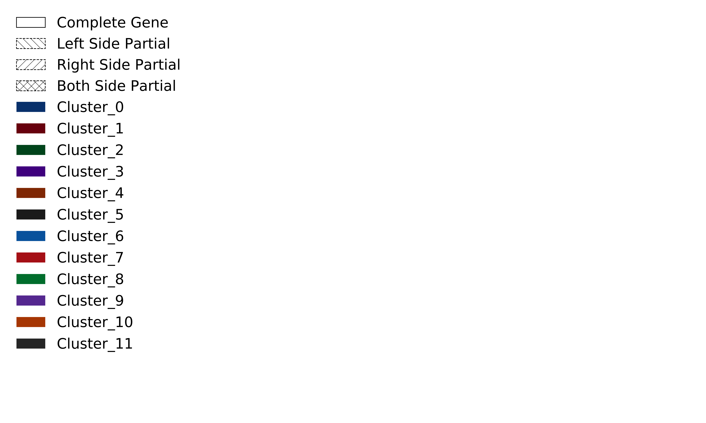

# Workflow to explore shared genes and gene synteny for a group of metagenome assembled contigs (or draft genome assembly contigs) in fasta format.

This workflow produces a gene synteny or gene neighborhood style plot placing arrows in the position and orientation of predicted gene regions on each contig in the set. Contigs are ordered along the y-axis by the user defined fasta file order, or, optionally, they can be ordered by contig length with the -y flag. Contigs are aligned along the x-axis by the first gene cluster that is shared between all contigs in the set, or, optionaly, they can be aligned by a user defined gene cluster with the -x flag. The plot is output in png format and the legend is written to a separate png file.

The idea is to identify a set of contigs containing a gene of interest using Blast+ (or other sequence alignment tool), predict CDS regions on the contigs (with Prodigal), cluster the predicted genes (with CD-HIT), and then plot the results for visual interpretation (with a Python script from this GitHub Repo). In the case that the sequence search identifies a certain gene on all contigs, but the gene prediction and clustering tools do not find the same gene cluster to be on all contigs, the contig(s) missing the alleged shared gene cluster will be centered on the x-axis for visual inspection compared to the other contigs. The CD-HIT clstr file can be modified to merge or adjust gene clusters manually if needed.

## Step 00: Required tools :: Python 3.6+, Blast+, Prodigal and CD-HIT.

### Python 3.6+ for running the Python scripts in this repo.

Information for installing and running Python can be found [here](https://www.python.org/). I recommend installing [mini conda](https://docs.conda.io/en/latest/miniconda.html) first and then creating an environment for Python 3.6+ and other tools for the project at hand.

*All Python scripts in this repo were written for Python 3.6+. If you get a syntax error the first time you run a script, please first check your Python version.*

### Blast+

Installation Details for Blast+ can be found [here](https://blast.ncbi.nlm.nih.gov/Blast.cgi?PAGE_TYPE=BlastDocs&DOC_TYPE=Download).

Or Blast+ can be easily installed using a [conda environment](https://docs.conda.io/en/latest/miniconda.html):

```bash
conda create -n blastplus
conda activate blastplus
conda install bioconda::blast=2.7.1 conda-forge::gnutls conda-forge::nettle
```

### Prodigal for protein coding gene prediction.
 
Information and installation instructions for Prodigal can be found [here](https://github.com/hyattpd/Prodigal). The publication is [here](https://www.ncbi.nlm.nih.gov/pmc/articles/PMC2848648/).

Prodigal can also be installed with a [conda environment](https://docs.conda.io/projects/conda/en/latest/user-guide/tasks/manage-environments.html):

```bash
conda create -n prodigal
conda activate prodigal
conda install -c bioconda prodigal
```

### CD-HIT to cluster predicted gene sequence.

Information and installation for CD-HIT can be found [here](https://github.com/weizhongli/cdhit/wiki/3.-User's-Guide). The publication can be found [here](https://academic.oup.com/bioinformatics/article/22/13/1658/194225).

CD-HIT can also be installed with a [conda environment](https://docs.conda.io/projects/conda/en/latest/user-guide/tasks/manage-environments.html):

```bash
conda create -n cdhit
conda activate cdhit
conda install -c bioconda cd-hit
```

## Step 01: Collect contigs to test in fasta format

The recommended strategy here is to use Blast+ or some other sequence search tool to identify contigs assembled from one or more metagenomic samples or draft genomes that all share sequence similarity to a gene(s) of interest. So first you need to have a gene(s) of interest (this part is not covered in the protocol). You also need metagenome or draft genome assemblies (also not covered in this protocol). Once you have these, make a Blast+ (or other search tool) database with the assemblies and search your gene(s) of interest against the contigs. I typically work with the tabular blast output format and customize the options to output the query and sequence lengths in columns 13 and 14. Using the tabular blast output with added sequence lengths I can filter the results for matches with a good (alignment length / query sequence length) ratio and also select contigs that are longer. Longer contigs will have more information about gene synteny and neighborhoods.

#### Example Command: Tabular Blast+ with added sequence lengths

*The gene sequences should be used as the query file and the metagenome assembled contigs should be used as the blast database or subject sequences. The downstream scripts expect the genes to be in the first column of the tabular blast output file and the metagenome assebled contigs to be in the second column.*

```bash
blastn -task 'megablast' -evalue 0.01 -max_target_seqs 20 -num_threads 2 -db {metagenome_assembled_contigs.fasta} -query {gene_sequences.fasta} -out {outfile_name} -outfmt '6 qseqid sseqid pident length mismatch gapopen qstart qend sstart send evalue bitscore qlen slen'
```

If you've used the above sequence search method, you can filter your results with 01a_BlastTab_BestHit_Filter.py Python script included in this GitHub Repo. You can decide the minimum percent sequence similarity (Default = 70%), the (alignment length / query sequence length) ratio * 100 (Percent match length: Default = 50), and minimum contig size (Default = 1000 base pairs).

The 01a_BlastTab_BestHit_Filter.py script writes several output files:
1. input_file.fltrdBstHts.blst - this is the filtered tabular blast output
1. input_file.metatemplate.txt - this is a list of genes with a header for the optional meta data file to use for the 01b_ContigFishing_Summary_Plot.py
1. input_file_QUERYNAME.fltrdBstHtsLst.txt - this is a list of the contig names to retrieve fasta format sequence for using the 01c_Retrieve_Fasta_Sequences.py script. There will be one file for each query sequence (genes of interest).

#### Example Command: Filter tabular Blast+ output with added sequence length

```bash
# To Display the program description and parameter options
python 01a_BlastTab_BestHit_Filter.py -h

# Example execution:
python 01a_BlastTab_BestHit_Filter.py -i tabular_blast_output.blast

# Loop through a list of tabular blast files:
for file in *blast; do echo $file; python 01a_BlastTab_BestHit_Filter.py -i $file; done
```

If you want to visualize the distribution of sequence similarity for genes of interests in the metagenome or draft genome assembly, the 01b_ContigFishing_Summary_Plot.py script included in this GitHub Repo provides a good image.

Assuming a select set of genes are used as blast query sequences, and assembled metagenome or draft genome contigs are used as the database or subject sequences, this script plots the percent IDs of the query matches along the x-axis for each query along the y-axis to show the distribution of similar sequences that are present in an assembly.

It is assumed the blast table has been filtered for quality matches.

#### Example Command: Plot distribution of sequence similarity to each gene of interest in the metagenome or draft genome assembly with default settings.

```bash
# To Display the program description and parameter options
python 01b_ContigFishing_Summary_Plot.py -h

# Example execution:
python 01b_ContigFishing_Summary_Plot.py -b tabular_blast_output.fltrdBstHts.blst
```


Optionally, an annotation metadata file can be given to match the query sequence names to a short or long gene name and to specify a custom  color. The order of the metadata file is also preserved to allow for custom arrangment along the y-axis. The metadata file format is a comma separated file with a header and three columns. You can specify colors and some annotations by leaving the blanks in the second column. You can specify annotations and use default colors by leaving all color fields blank.

Example Complete Metadata:

    query name, annotation, color
    name_one, geneA, #006837
    name_two, geneB, #0868ac
    name_three, geneC, #e6550d

Example Metadata no color:

    query name, annotation, color
    name_one, geneA
    name_two, geneB
    name_three, geneC

Example Metadata no annotation:

    query name, annotation, color
    name_one, , #006837
    name_two, , #0868ac
    name_three, , #e6550d

#### Example Command: Plot distribution of sequence similarity to each gene of interest in the metagenome or draft genome assembly using an annotation file to control y-axis labels and colors.

```bash
# To Display the program description and parameter options
python 01b_ContigFishing_Summary_Plot.py -h

# Example execution:
python 01b_ContigFishing_Summary_Plot.py -b tabular_blast_output.fltrdBstHts.blst -m tabular_blast_output.metatemplate.txt
```


Now, looking at the plots above we can identify which gene of interest has some contigs we want to explore. For example, the *S_ruber_randomG_0002_50_8 (or Rare - SusD/RagB family starch-binding outer membrane protein)* gene has several contigs at 100% ID, 95% ID, 82% ID, and 71% ID. We can select the appropriate input_file_QUERYNAME.fltrdBstHtsLst.txt file and retrieve the fasta sequence for the contigs identified using the 01c_Retrieve_Fasta_Sequences.py script included in this GitHub Repo.

#### Example Command: Retrieving selected contigs in fasta format

```bash
# To Display the program description and parameter options
python 01c_Retrieve_Fasta_Sequences.py -h

# Example execution:
python 01c_Retrieve_Fasta_Sequences.py -c input_file_QUERYNAME.fltrdBstHtsLst.txt -a Metagenome_Assembly_Used_as_Blast_db.fasta -o ContigsMatching_QUERYNAME.fasta
```

*If you wish to change the y-axis labels of contig names of the arrow plot in Step 04 you should rename the sequence labels in the ContigsMatching_QUERYNAME.fasta file before running Prodigal in Step 02. This can be done manually in a text editor. Change all the lines in the file starting with a '>' symbol to reflect a meaningful sample or experiment name etc... The name should not contain any spaces. Use an underscore for delimiting like: >Exp01_Site02_Smpl03_AssemblyA_Contig01*

## Step 02: Predict gene regions on selected contigs with Prodigal.

Now that you have a fasta file containing all the contigs that potentially contian a copy of your gene(s) of interest, predict all the CDS regions on the contig set. I like to have Prodigal output a GFF file, a fasta file of nucleotide sequences (.fna), and a fasta file of translated amino acid sequences (.faa) so I have them if I need want them at a later point.

#### Example Command: Predict CDS regions with Prodigal

```bash
# default prodigal output to -o is genbank or gbk format
# -p meta indicates contigs from a metagenome assembly
prodigal -i ContigsMatching_QUERYNAME.fasta -p meta -o ContigsMatching_QUERYNAME_genes.gbk -a ContigsMatching_QUERYNAME_genes.faa -d ContigsMatching_QUERYNAME_genes.fna
```

Prodigal can sometimes predict many genes 300 amino acids or less and these can overlap with longer genes as well as other short genes. A few of these small genes may be real, but many are likely false positive gene predictions. The 02b_Filter_Prodigal_GeneLength.py script included in this GitHub Repo will filter the prodigal output by sequence length. If you want this option, you should filter before running CD-HIT. A minimum sequence length of 300 characters is the default setting intended to remove protein sequences less than 300 amino acids. This can be changed using the optional parameter -m to raise or lower the minimum such as if gene sequence in nucleotides are being used to calculate the gene clusters set -m 900.

```bash
# To Display the program description and parameter options
python 02a_Filter_Prodigal_GeneLength.py -h

# If using amino acid sequence
python 02a_Filter_Prodigal_GeneLength.py -i ContigsMatching_QUERYNAME_genes.faa

# If using nucleotide sequence
python 02a_Filter_Prodigal_GeneLength.py -i ContigsMatching_QUERYNAME_genes.fna
```

## Step 03: Cluster predicted genes with CD-HIT (or CD-HIT-EST).

CD-HIT has many options. You can cluster your predicted gene sequences using the nucleotide sequence (with CD-HIT-EST) for higher resolution with less divergent gene sequences, or you can use CD-HIT with amino acid sequences for more divergent gene sequences. For now we will use amino acid sequence and cluster using 40% sequence identity with an alignment over at least 70% of the shorter sequence. It is good to think about and test the best parameters for your project and questions.

#### Example Command: Cluster genes using a 40% minimum sequence identity for amino acid alignments and a minimum (alignment length / short sequence length) ratio of 0.7.

```bash
# simply type cd-hit to see a full list of parameters and explanations
cd-hit -i ContigsMatching_QUERYNAME_genes.faa.lenfltr -o ContigsMatching_QUERYNAME_genes.cdhit.faa -c 0.4 -n 2 -G 0 -g 1 -aS 0.7 -d 0
```

This will output two files. The my_proteins.cdhit.faa file contains representative (longest) protein sequence for each gene cluster. These sequences can be used for Step 05 to add functional annotation information to the gene cluster. The my_proteins.cdhit.faa.clstr contains the actual gene cluster information. We will use the clstr file to build the plot in Step 04.

## Step 04: Build the plot.

The 04a_ContigSynteny_Plot.py script included in this GitHub Repo will take the contig_set.fasta, the my_proteins.faa and the my_proteins.cdhit.faa.clstr file and the build the plot.

```bash
python 04a_ContigSynteny_Plot.py -c ContigsMatching_QUERYNAME.fasta -p ContigsMatching_QUERYNAME_genes.faa -r ContigsMatching_QUERYNAME_genes.cdhit.faa.clstr -o ContigsMatching_QUERYNAME_Synteny_Plot.png -y
```




## Step 05: Customize and Add Annotations

The y-axis labels are straight from the contig names in the contig fasta file. Changing the sequence names in the contig fasta file will change the names on the plot.

Add option to provide annotation for each gene cluster and a custom color in a metadata table file. I've built this into the code, just need to refine and test it.


